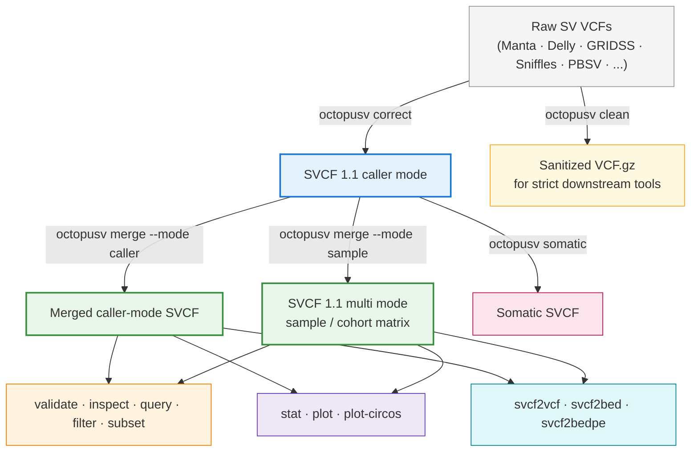
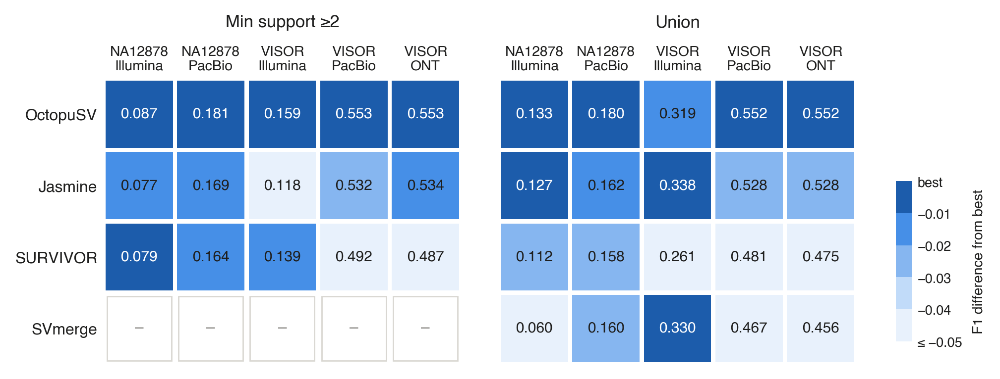

# OctopuSV: multi-caller, multi-sample, and cohort-scale structural variant comparison and analysis 🐙

<p align="center">
  
</p>

[](https://pypi.org/project/octopusv/)
[](https://bioconda.github.io/recipes/octopusv/README.html)
[](https://anaconda.org/bioconda/octopusv)
[](https://pepy.tech/projects/octopusv)
[](https://doi.org/10.1093/bioinformatics/btaf599)
[](https://pypi.org/project/octopusv/)
[](https://opensource.org/licenses/MIT)

> *Standardize, integrate, compare, and analyze structural variants across callers, samples, and cohorts.*

> [!NOTE]
> **What's new in v1.0.0**
>
> - **SVCF 1.1** introduces a versioned caller and multi-sample data model.
> - Multi-caller and multi-sample workflows now use explicit source, evidence, and sample relationships.
> - Sample-mode merging supports cohort-scale analysis while preserving stable biological sample columns.
> - BND, TRA, GRIDSS, VCF conversion, reference metadata, and contig compatibility handling have been tightened across the workflow.
> - `--max-distance`, `--max-length-ratio`, and `--min-jaccard` are active merge controls, with conflicting merge strategies rejected early.
>
> See [`docs/RELEASE_NOTES_1.0.0.md`](docs/RELEASE_NOTES_1.0.0.md) for release details.

> [!TIP]
> **Genome-wide SV visualization**  
> `octopusv plot-circos` draws a genome-wide SV Circos overview from an SVCF file, including intra-chromosomal SV links, translocations, insertion markers, and breakpoint-density tracks.
>
> ```bash
> octopusv plot-circos \
>   -i merged.svcf \
>   -o circos.png \
>   --include-ins
> ```

<p align="center">
  
</p>

> [!IMPORTANT]
> **Use the latest release for current SVCF 1.1 behavior.**
>
> ```bash
> conda install bioconda::octopusv
> ```

<details>
<summary><b>Previous releases</b></summary>

- **v0.4.3** — Merge-control fixes and safer SVCF coordinate handling.
- **v0.4.2** — Major merge-performance improvements, SVIM-ASM compatibility, and TRA/BND updates.
- **v0.4.1** — Multi-sample merging, TRA/BND integration, and Circos improvements.
- **v0.4.0** — Added the SVCF operation layer for validation, inspection, querying, filtering, subsetting, normalization, and export.
- **v0.3.x** — Added GRIDSS support, `clean`, genome-wide visualization, and early multi-sample support.

</details>

---

## What OctopuSV is for

Structural variant callers often describe the same event in different ways. Coordinates, BND notation, FORMAT fields, caller-specific IDs, sample columns, and metadata can all differ between tools.

OctopuSV provides one workflow for bringing those calls into a consistent representation and working with them across callers and samples.

The main use cases are:

1. **BND standardization**  
   Resolve paired BND records into DEL, INV, DUP, INS, or TRA when the breakpoint evidence supports it. Records that cannot be resolved safely can remain BND.

2. **Multi-caller integration**  
   Merge calls from tools such as Manta, Delly, GRIDSS, Sniffles, PBSV, SVIM, CuteSV, and others using support thresholds, intersections, unions, specific-set queries, or Boolean expressions.

3. **Multi-sample and cohort integration**  
   Compare SVs across biological samples while keeping a stable sample matrix and sample-level call structure.

4. **SVCF-aware downstream analysis**  
   Validate, inspect, query, filter, subset, normalize, visualize, and export SV records without losing the source/evidence/sample relationships created during integration.

OctopuSV can be used for single samples, multi-caller analyses, tumor/normal workflows, and larger cohorts.

---

## SVCF 1.1

SVCF is the intermediate format used by OctopuSV. Version 1.1 is the format contract for OctopuSV 1.0.

SVCF 1.1 has two explicit data models.

### Caller mode

Caller mode keeps the source-level evidence associated with each merged SV event.

```text
SV event
  ├── source A evidence
  ├── source B evidence
  └── source B evidence
```

When `SOURCES` and `SOURCE_IDS` are present, their positions are bound to the evidence blocks:

```text
SOURCES[i]
↔ SOURCE_IDS[i]
↔ evidence block i
```

A caller may contribute more than one evidence record to the same event. Those records are preserved individually.

### Multi mode

Multi mode stores one fixed column per biological sample and synthesizes a sample-level call from the caller evidence available for that sample.

```text
SV event
  ├── sample 1
  ├── sample 2
  └── sample 3
```

Caller votes are counted by unique caller, so multiple records from the same caller do not count as multiple independent votes.

True unobserved sample/event combinations remain distinguishable from evidence-backed `0/0` calls. During VCF export, unobserved samples are written as `./.` by default.

For the full format definition, see:

📋 [SVCF 1.1 specification](docs/SVCF_specifications.md)

> [!NOTE]
> Caller-mode SVCF is an intermediate format and is not guaranteed to behave like a conventional VCF sample matrix. Use `octopusv svcf2vcf` before passing merged SVCF files to tools such as bcftools or vcftools.

For cohort workflows, the recommended pattern is to create one caller-mode SVCF per biological sample and then merge those files with `--mode sample`.

---

## How OctopuSV works



Different callers use different field names, coordinate conventions, breakpoint representations, and sample layouts. SVCF gives OctopuSV a consistent internal representation so the same downstream operations can be applied across those inputs.

A typical multi-caller workflow looks like this:

```bash
# Step 1: standardize caller outputs
octopusv correct -i manta_output.vcf -o manta.svcf
octopusv correct -i gridss_output.vcf -o gridss.svcf
octopusv correct -i sniffles_output.vcf -o sniffles.svcf

# Step 2: merge and inspect
octopusv merge \
  -i manta.svcf gridss.svcf sniffles.svcf \
  -o merged.svcf \
  --min-support 2

octopusv validate-svcf -i merged.svcf
octopusv inspect -i merged.svcf --id Sniffles2.INS.1DS0

# Step 3: export to standard formats
octopusv svcf2vcf -i merged.svcf -o final_results.vcf
octopusv svcf2bedpe -i merged.svcf -o final_results.bedpe
```

---

## Supported SV callers

**Long-read callers:** Sniffles, Severus, SVDSS, DeBreak, SVIM, SVIM-ASM, CuteSV, PBSV, nanomonsv

**Short-read callers:** Manta, Delly, GRIDSS, Lumpy, SvABA, Octopus, CLEVER

**CNV callers:** DRAGEN CNV, with automatic conversion of supported CNV records to DEL/DUP

Support for additional callers can be added as new formats and edge cases are reported.

---

## Published benchmarking

OctopuSV was benchmarked against commonly used SV merging tools across real and simulated short-read and long-read datasets.

The figure below summarizes F1 scores for two commonly used merging strategies: requiring support from at least two callers and taking the union of all calls. Values are shown for NA12878 and VISOR datasets across Illumina, PacBio, and Oxford Nanopore sequencing.

<p align="center">
  
</p>

---

## Installation

### Bioconda

```bash
conda install bioconda::octopusv
```

or:

```bash
mamba install bioconda::octopusv
```

Bioconda is the recommended installation route because it includes the external command-line tools used by OctopuSV workflows.

### PyPI

```bash
pip install octopusv
```

> [!NOTE]
> `octopusv clean` requires `bcftools`, `bgzip`, and `tabix`. If OctopuSV was installed with pip, install those tools separately:
>
> ```bash
> conda install -c bioconda bcftools htslib
> ```

### Docker

```bash
docker pull quay.io/biocontainers/octopusv:<tag>
```

See the available container tags at:

https://quay.io/repository/biocontainers/octopusv?tab=tags

### From source

```bash
git clone https://github.com/ylab-hi/OctopuSV.git
cd OctopuSV
mamba env create -f environment.yaml
mamba activate octopusv
poetry install
```

---

# Quick start

## 1. Correct and standardize SV calls

`octopusv correct` converts raw caller output into SVCF.

```bash
# Basic correction
octopusv correct -i input.vcf -o output.svcf

# BND pairing tolerance
octopusv correct \
  -i input.vcf \
  -o output.svcf \
  --pos-tolerance 5

# Apply size and FILTER constraints
octopusv correct \
  -i input.vcf \
  -o output.svcf \
  --min-svlen 50 \
  --max-svlen 100000 \
  --filter-pass
```

For paired BND records, OctopuSV resolves the event into a standard SV type when the available breakpoint information supports it.

True single-breakends are skipped by default with an explicit note in the command output and a count in the SVCF header. Use:

```bash
--strict-single-breakends
```

if you prefer `correct` to stop on these records.

---

## 2. Merge SV calls

`octopusv merge` works in caller mode or sample mode.

### Multi-caller

```bash
# Intersection
octopusv merge \
  -i manta.svcf sniffles.svcf pbsv.svcf \
  -o intersection.svcf \
  --intersect

# Union
octopusv merge \
  -i caller1.svcf caller2.svcf caller3.svcf \
  -o union.svcf \
  --union

# Minimum source support
octopusv merge \
  -i a.svcf b.svcf c.svcf d.svcf \
  -o supported.svcf \
  --min-support 3

# Specific input
octopusv merge \
  -i manta.svcf sniffles.svcf \
  -o manta_specific.svcf \
  --specific manta.svcf

# Boolean expression
octopusv merge \
  -i A.svcf B.svcf C.svcf D.svcf \
  -o filtered.svcf \
  --expression "(A AND B) AND NOT (C OR D)"
```

Custom source labels can be supplied with:

```bash
--caller-names "manta,gridss,sniffles"
```

These labels affect source identity in the output. They do not change the merge criteria.

### Multi-sample / cohort

```bash
octopusv merge \
  -i sample1.svcf sample2.svcf sample3.svcf \
  -o cohort.svcf \
  --mode sample \
  --sample-names Patient1,Patient2,Patient3 \
  --min-support 2
```

Sample mode keeps one fixed output column per biological sample.

### Merge controls

For DEL, DUP, and INV, matching can be adjusted with:

```bash
--max-distance
--max-length-ratio
--min-jaccard
```

`--min-jaccard` is disabled by default (`0`).

Merge strategies are mutually exclusive. For example, use either:

```bash
--intersect
```

or:

```bash
--min-support 3
```

rather than supplying both.

### UpSet plot

```bash
octopusv merge \
  -i a.svcf b.svcf c.svcf \
  -o merged.svcf \
  --intersect \
  --upsetr \
  --upsetr-output venn_diagram.png
```

<p align="center">
  
</p>

---

## 3. Validate and inspect SVCF files

```bash
# Show SVCF header and metadata
octopusv header -i merged.svcf

# Validate SVCF structure
octopusv validate-svcf -i merged.svcf

# Inspect one record
octopusv inspect \
  -i merged.svcf \
  --id Sniffles2.INS.1DS0

# Inspect multiple records and export JSONL
octopusv inspect \
  -i merged.svcf \
  --id-file candidate_ids.txt \
  --jsonl > records.jsonl
```

`validate-svcf` checks the SVCF version and mode, FORMAT layout, required INFO fields, source/evidence binding, sample-column structure, BND/TRA coordinates, and other SVCF 1.1 rules.

`inspect` reports event coordinates, `SOURCES`, `SOURCE_IDS`, and the associated evidence or sample blocks.

---

## 4. Query, filter, and subset

These commands preserve SVCF structure while selecting records or sample/source columns.

```bash
# Query by region
octopusv query \
  -i merged.svcf \
  --region chr1:1000000-2000000 \
  -o region_hits.svcf

# Filter by SV type
octopusv filter \
  -i merged.svcf \
  --svtype DEL \
  --svtype DUP \
  -o del_dup.svcf

# Filter by support
octopusv filter \
  -i merged.svcf \
  --min-support 2 \
  -o support2.svcf

# Subset sample/source columns
octopusv subset \
  -i merged.svcf \
  --sample sampleA \
  --sample sampleB \
  -o subset.svcf
```

See the command help for additional query and filtering options:

```bash
octopusv query -h
octopusv filter -h
octopusv subset -h
```

---

## 5. Normalize contig names

Use `normalize-contigs` when files use different naming styles such as `1` and `chr1`.

```bash
octopusv normalize-contigs \
  -i merged.svcf \
  -o merged.normalized.svcf
```

This changes contig naming only. It does not perform coordinate liftover.

OctopuSV also checks known contig lengths before merge. Inputs with conflicting lengths for the same contig are rejected rather than silently combined.

---

## 6. Somatic SV analysis

Tumor and normal calls can be compared after correction to SVCF.

```bash
octopusv somatic \
  -t tumor.svcf \
  -n normal.svcf \
  -o somatic.svcf
```

Matching parameters can be adjusted when needed:

```bash
octopusv somatic \
  -t tumor.svcf \
  -n normal.svcf \
  -o somatic.svcf \
  --max-distance 100 \
  --min-jaccard 0.8
```

The result can be converted back to VCF:

```bash
octopusv svcf2vcf \
  -i somatic.svcf \
  -o somatic.vcf
```

A multi-caller tumor workflow can also be built first:

```bash
octopusv correct -i manta_tumor.vcf -o manta_tumor.svcf
octopusv correct -i delly_tumor.vcf -o delly_tumor.svcf
octopusv correct -i gridss_tumor.vcf -o gridss_tumor.svcf

octopusv merge \
  -i manta_tumor.svcf delly_tumor.svcf gridss_tumor.svcf \
  -o high_confidence_somatic.svcf \
  --min-support 2
```

---

## 7. Clean VCFs for strict downstream tools

Some VCFs contain missing definitions or formatting choices that strict tools such as Truvari or bcftools will reject.

`octopusv clean` produces a sorted, bgzipped, tabix-indexed VCF for downstream use.

```bash
# Basic cleaning
octopusv clean broken.vcf fixed.vcf.gz

# Harmonize chromosome names against a reference FASTA
octopusv clean \
  broken.vcf \
  fixed.vcf.gz \
  -g /path/to/reference.fa

# Example before Truvari
octopusv clean \
  calls.vcf \
  calls_clean.vcf.gz \
  -g GRCh38.fa

truvari bench \
  -b truth.vcf.gz \
  -c calls_clean.vcf.gz \
  -f GRCh38.fa \
  -o bench_results/
```

`clean` can:

- remove `RNAMES` and sanitize problematic INFO values
- fill missing `SVLEN` when it can be derived from the record
- ensure a valid `GT` field
- add missing INFO/FORMAT definitions
- harmonize contig names against a reference FASTA
- sort, bgzip, and tabix-index the output

---

## 8. Benchmark against a truth set

```bash
octopusv benchmark \
  truth.vcf \
  calls.svcf \
  -o benchmark_results \
  --reference-distance 500 \
  --size-similarity 0.7 \
  --reciprocal-overlap 0.0 \
  --size-min 50 \
  --size-max 50000
```

---

## 9. Statistics and visualization

```bash
# Basic statistics
octopusv stat \
  -i input.svcf \
  -o stats.txt

# Add an HTML report
octopusv stat \
  -i input.svcf \
  -o stats.txt \
  --report

# Plot figures from the statistics file
octopusv plot \
  stats.txt \
  -o figure_prefix
```

The HTML report includes SV type and size distributions, chromosome summaries, quality metrics, genotype features, and depth-related summaries when available.

<p align="center">
  
</p>

### Circos overview

```bash
# Basic genome-wide view
octopusv plot-circos \
  -i input.svcf \
  -o circos.png

# Translocations only
octopusv plot-circos \
  -i input.svcf \
  -o circos_tra.png \
  --tra-only

# Custom reference sizes
octopusv plot-circos \
  -i input.svcf \
  -o circos.png \
  --fai reference.fa.fai
```

INS is excluded from links by default. See:

```bash
octopusv plot-circos -h
```

for support thresholds, span filters, per-type toggles, insertion display, and styling options.

---

## 10. Format conversion

```bash
# SVCF to BED
octopusv svcf2bed \
  -i input.svcf \
  -o output.bed

# SVCF to BEDPE
octopusv svcf2bedpe \
  -i input.svcf \
  -o output.bedpe

# SVCF to standard VCF
octopusv svcf2vcf \
  -i input.svcf \
  -o output.vcf
```

`svcf2vcf` writes VCF4.2-compatible output while keeping the merged event information needed for downstream analysis.

For SVCF 1.1 multi-mode files, true unobserved sample/event placeholders are exported as `./.` by default. To export those placeholders as `0/0` instead:

```bash
octopusv svcf2vcf \
  -i cohort.svcf \
  -o cohort.vcf \
  --unobserved-sample-gt ref
```

For insertions, OctopuSV uses an internal SVCF span during processing. VCF export writes the conventional insertion endpoint with `END=POS`.

---

## Example visualizations

<p align="center">
  
</p>

<p align="center">
  
</p>

<p align="center">
  
</p>

---

## Citation

If you use OctopuSV in your research, please cite:

> Guo, Qingxiang, Yangyang Li, Ting-You Wang, Abhi Ramakrishnan, and Rendong Yang. "OctopuSV and TentacleSV: a one-stop toolkit for multi-sample, cross-platform structural variant comparison and analysis." *Bioinformatics* (2025): btaf599. https://doi.org/10.1093/bioinformatics/btaf599

```bibtex
@article{guo2025octopusv,
  title={OctopuSV and TentacleSV: a one-stop toolkit for multi-sample, cross-platform structural variant comparison and analysis},
  author={Guo, Qingxiang and Li, Yangyang and Wang, Ting-You and Ramakrishnan, Abhi and Yang, Rendong},
  journal={Bioinformatics},
  pages={btaf599},
  year={2025},
  publisher={Oxford University Press}
}
```

If OctopuSV is useful in your work, a ⭐ on GitHub helps other users find the project.

Companion pipeline: [TentacleSV](https://github.com/ylab-hi/TentacleSV)

---

## Contributing

Issues, suggestions, and pull requests are welcome.

```bash
git clone https://github.com/ylab-hi/OctopuSV.git
cd OctopuSV
mamba env create -f environment.yaml
mamba activate octopusv
poetry install
pre-commit run -a
```

---

## Contact

- GitHub Issues: https://github.com/ylab-hi/OctopuSV/issues
- Qingxiang Guo: qingxiang.guo@northwestern.edu
- Yangyang Li: yangyang.li@northwestern.edu
