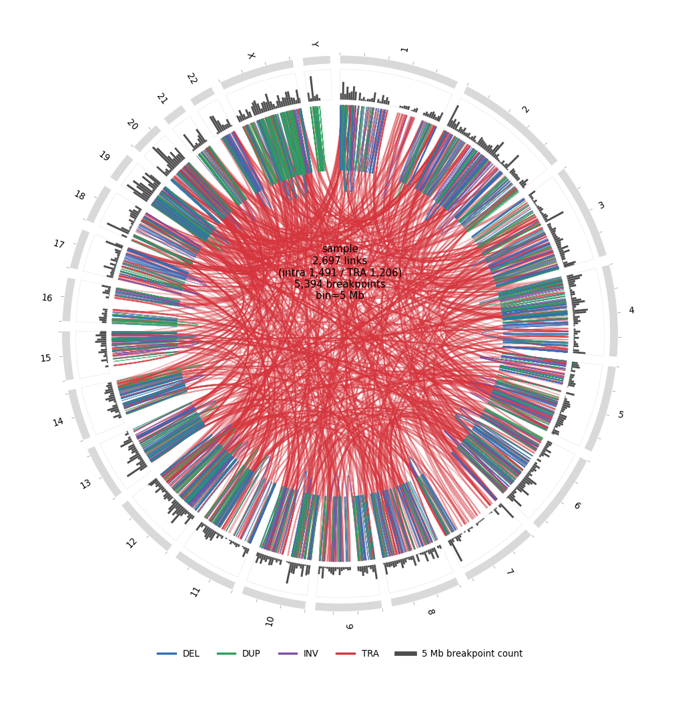
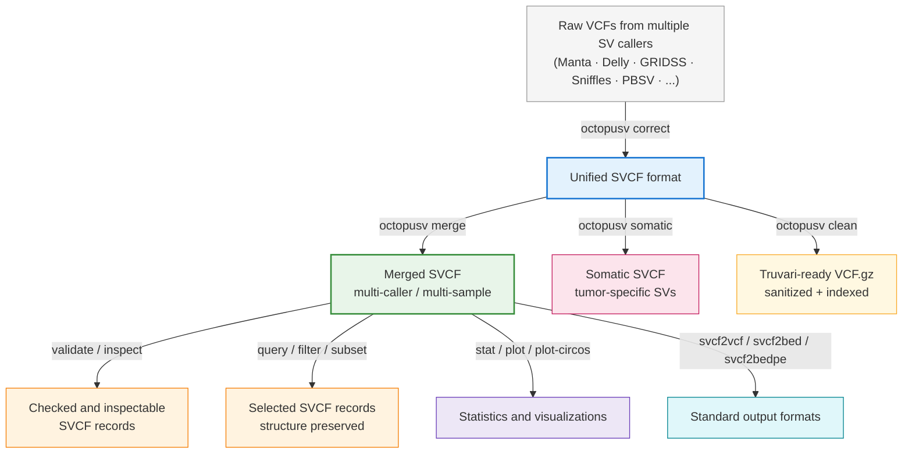

# OctopuSV: End-to-end structural variant post-processing 🐙

<p align="center">
  
</p>

[](https://badge.fury.io/py/octopusv)
[](https://bioconda.github.io/recipes/octopusv/README.html)
[](https://opensource.org/licenses/MIT)

> *Unify, merge, inspect, query, compare, and export structural variants across callers and samples.*

> [!NOTE]
> **What's New in v0.4.2** — Major merge performance improvements and compatibility updates.
>
> **~40× faster merge on a 100k-event benchmark**
>
> The merge engine has been substantially optimized without changing the underlying merge logic or output semantics. In a single-thread, 3-input union benchmark with 100,372 merged events, runtime decreased from **240.49 s to 6.07 s (~39.6× faster)** while peak memory usage remained essentially unchanged.
>
> - Optimized SV, TRA, and BND candidate matching by eliminating comparisons that the existing merge rules are guaranteed to reject.
> - Added tested compatibility with SVIM-ASM output.
> - Improved VCF4.2-compatible TRA export with `octopusv svcf2vcf`.
> - Expanded regression testing for caller-mode and sample-mode merging.

> [!TIP]
> **Genome-wide SV visualization** — `octopusv plot-circos` draws a genome-wide SV Circos overview from an SVCF file, with intra-chromosomal SV links, translocations, insertion markers, and breakpoint-density tracks.
>
> ```bash
> octopusv plot-circos \
>   -i merged.svcf \
>   -o circos.png \
>   --include-ins
> ```

<p align="center">
  
</p>

> [!IMPORTANT]
> **Always use the latest version for best results.**
>
> ```bash
> conda install bioconda::octopusv
> ```

<details>
<summary><b>Previous releases</b></summary>

- **v0.4.1** — Improved multi-sample merging, TRA/BND integration, and Circos plotting, including fixes for sample evidence placement, reciprocal breakend merging, and insertion visualization.
- **v0.4.0** — Added a more complete SVCF operation layer for validation, inspection, querying, filtering, subsetting, normalization, and improved VCF export and provenance handling.
- **v0.3.5** — Added genome-wide SV visualization with `octopusv plot-circos`.
- **v0.3.3** — Improved `octopusv correct` support for multi-sample VCFs, including joint-called outputs from GRIDSS, DELLY, and related callers.
- **v0.3.2** — Added `octopusv clean`, which sanitizes broken VCFs so strict tools such as Truvari and bcftools can parse them.
- **v0.3.1** — Added native GRIDSS support. `octopusv correct` resolves paired BND records into standard SV types directly, without external preprocessing.

</details>

---

**OctopuSV** addresses four key challenges in structural variant (SV) analysis:

1. **Smart BND standardization** — Converts paired BND records into standard SV types (DEL/INV/DUP/INS/TRA), while preserving potential complex rearrangements as BNDs. Works out of the box with BND-heavy callers such as GRIDSS and SvABA.
2. **Multi-caller integration** — Merges SVs from different tools such as Manta, Delly, GRIDSS, Sniffles, PBSV, SVIM, CuteSV, and others with flexible support-based or Boolean strategies.
3. **Multi-sample integration** — Compares and analyzes SVs across samples or cohorts with structure-preserving sample-level merging.
4. **SVCF-centered operations** — Validates, inspects, queries, filters, subsets, normalizes, visualizes, and exports merged SV records while preserving caller/sample provenance.

Whether you are analyzing single samples, cohorts, or tumor/normal pairs, OctopuSV standardizes your workflow from raw SV calls to consistent SVCF and standard downstream-compatible outputs.

---

## How OctopuSV Works

OctopuSV converts SV caller VCF outputs into a unified intermediate format (**SVCF**), enabling consistent merging, comparison, inspection, and conversion across callers and samples. Results can be exported back to standard VCF, BED, or BEDPE formats.



**Why SVCF?** Different SV callers implement VCF inconsistently: varying field names, BND notations, coordinate conventions, and sample/caller evidence fields. SVCF reduces these compatibility issues by providing a unified intermediate format for practical SV operations.

```bash
# Step 1: Standardize caller outputs
octopusv correct manta_output.vcf manta.svcf
octopusv correct gridss_output.vcf gridss.svcf
octopusv correct sniffles_output.vcf sniffles.svcf

# Step 2: Merge and analyze with a consistent format
octopusv merge -i manta.svcf gridss.svcf sniffles.svcf -o merged.svcf --min-support 2
octopusv validate-svcf -i merged.svcf
octopusv inspect -i merged.svcf --id Sniffles2.INS.1DS0

# Step 3: Convert back to standard formats
octopusv svcf2vcf -i merged.svcf -o final_results.vcf
octopusv svcf2bedpe -i merged.svcf -o final_results.bedpe
```

📋 **SVCF Format Details**: See the [SVCF specification document](https://github.com/ylab-hi/OctopuSV/blob/main/docs/SVCF_specifications.md) for technical details.

---

## Supported SV Callers

**Long-read callers**: Sniffles, Severus, SVDSS, DeBreak, SVIM, SVIM-ASM, CuteSV, PBSV, nanomonsv

**Short-read callers**: Manta, Delly, GRIDSS, Lumpy, SvABA, Octopus, CLEVER

**CNV callers**: Dragen CNV, with automatic conversion of CNV records to DEL/DUP when appropriate

Support for additional callers continues to expand.

---

## Installation

### Bioconda recommended

```bash
conda install bioconda::octopusv
```

Or with mamba for faster dependency resolution:

```bash
mamba install bioconda::octopusv
```

Bioconda installation includes the required Python dependencies and command-line tools used by OctopuSV workflows.

### PyPI

```bash
pip install octopusv
```

> [!NOTE]
> The `octopusv clean` subcommand requires `bcftools`, `bgzip`, and `tabix` as external tools. If you installed OctopuSV via pip, install them separately:
>
> ```bash
> conda install -c bioconda bcftools htslib
> ```
>
> If you installed OctopuSV via Bioconda, these tools are already included.

### Docker

```bash
docker pull quay.io/biocontainers/octopusv:<tag>
```

See [octopusv/tags](https://quay.io/repository/biocontainers/octopusv?tab=tags) for available container tags.

### From source for developers

```bash
git clone https://github.com/ylab-hi/OctopuSV.git
cd OctopuSV
mamba env create -f environment.yaml
mamba activate octopusv
poetry install
```

---

## Quick Start

### 1. Correct and Standardize BND Annotations

`octopusv correct` converts raw SV caller output into standardized SVCF format. This includes resolving paired BND records into concrete SV types and detecting insertions from BND pairs with long inserted sequences.

```bash
# Basic correction
octopusv correct input.vcf output.svcf

# With position tolerance control for BND pairing
octopusv correct -i input.vcf -o output.svcf --pos-tolerance 5

# Apply quality filters
octopusv correct -i input.vcf -o output.svcf --min-svlen 50 --max-svlen 100000 --filter-pass
```

### 2. Merge SV Calls Multi-caller or Multi-sample

`octopusv merge` combines standardized SVCF files using flexible support and set-operation strategies.

```bash
# Intersection: SVs found by all input files
octopusv merge -i manta.svcf sniffles.svcf pbsv.svcf -o intersection.svcf --intersect

# Union: SVs found by any input file
octopusv merge -i caller1.svcf caller2.svcf caller3.svcf -o union.svcf --union

# Minimum support: SVs supported by at least N callers or samples
octopusv merge -i a.svcf b.svcf c.svcf d.svcf -o supported.svcf --min-support 3

# Specific input: SVs unique to one caller or sample
octopusv merge -i manta.svcf sniffles.svcf -o manta_specific.svcf --specific manta.svcf

# Complex Boolean logic: A and B but not C or D
octopusv merge -i A.svcf B.svcf C.svcf D.svcf \
  --expression "(A AND B) AND NOT (C OR D)" -o filtered.svcf

# Multi-sample mode with custom names
octopusv merge -i sample1.svcf sample2.svcf sample3.svcf \
  --mode sample --sample-names Patient1,Patient2,Patient3 \
  --min-support 2 -o cohort.svcf

# Generate an UpSet plot
octopusv merge -i a.svcf b.svcf c.svcf -o merged.svcf --intersect \
  --upsetr --upsetr-output venn_diagram.png
```

<p align="center">
  
</p>

### 3. Validate and Inspect SVCF Files

OctopuSV v0.4.0 adds inspection and validation commands for checking SVCF structure, provenance, and individual merged records.

```bash
# Show the header and metadata contract
octopusv header -i merged.svcf

# Validate SVCF structure and provenance consistency
octopusv validate-svcf -i merged.svcf

# Inspect one merged SV record by ID
octopusv inspect -i merged.svcf --id Sniffles2.INS.1DS0

# Inspect multiple records and export JSONL
octopusv inspect -i merged.svcf --id-file candidate_ids.txt --jsonl > records.jsonl
```

`inspect` reports parsed endpoints, span, `SOURCES`, `SOURCE_IDS`, and per-caller or per-sample evidence blocks. This is useful for checking merged records before conversion, visualization, benchmarking, or other downstream workflows.

### 4. Query, Filter, and Subset SVCF Records

OctopuSV v0.4.0 provides structure-preserving SVCF operations. These commands keep the SVCF header, INFO fields, FORMAT fields, sample/caller columns, and provenance fields consistent.

```bash
# Query records by genomic region
octopusv query -i merged.svcf --region chr1:1000000-2000000 -o region_hits.svcf

# See all target-query options, including feature-based query modes
octopusv query -h

# Filter records by SV type
octopusv filter -i merged.svcf --svtype DEL --svtype DUP -o del_dup.svcf

# Filter records by support
octopusv filter -i merged.svcf --min-support 2 -o support2.svcf

# Subset sample/caller evidence columns
octopusv subset -i merged.svcf --sample sampleA --sample sampleB -o subset.svcf
```

These operations are SVCF-aware: they preserve both breakpoints, `CHR2`/`END`, caller/sample provenance, and merged evidence columns.

### 5. Normalize SVCF Contig Names

Use `normalize-contigs` when input files use different standard chromosome naming styles, such as `chr1` versus `1`.

```bash
# Normalize standard contig names without changing coordinates
octopusv normalize-contigs -i merged.svcf -o merged.normalized.svcf
```

This command normalizes standard contig names only. It does not lift over coordinates or alter breakpoint positions.

### 6. Somatic SV Calling

Use any SV caller to analyze tumor and normal samples separately, then let OctopuSV find tumor-specific variants. This works even with callers not designed specifically for cancer analysis.

```bash
# Basic somatic calling
octopusv somatic -t tumor.svcf -n normal.svcf -o somatic.svcf

# With custom matching parameters
octopusv somatic -t tumor.svcf -n normal.svcf -o somatic.svcf \
  --max-distance 100 --min-jaccard 0.8

# Convert to standard VCF for downstream analysis
octopusv svcf2vcf -i somatic.svcf -o somatic.vcf
```

Example multi-caller somatic workflow:

```bash
# Standardize tumor calls from multiple callers
octopusv correct manta_tumor.vcf manta_tumor.svcf
octopusv correct delly_tumor.vcf delly_tumor.svcf
octopusv correct gridss_tumor.vcf gridss_tumor.svcf

# Keep SVs supported by at least 2 out of 3 callers
octopusv merge -i manta_tumor.svcf delly_tumor.svcf gridss_tumor.svcf \
  -o high_confidence_somatic.svcf --min-support 2
```

### 7. Clean Broken VCFs for Downstream Tools

Some callers produce VCFs that are technically valid but break strict parsers such as Truvari or bcftools due to missing header definitions, illegal characters in INFO fields, inconsistent chromosome naming, missing `GT`, or missing `SVLEN`.

`octopusv clean` fixes these issues without filtering variants, producing a sorted, bgzipped, tabix-indexed VCF ready for downstream benchmarking.

```bash
# Basic clean without chromosome harmonization
octopusv clean broken.vcf fixed.vcf.gz

# With reference FASTA for chromosome name harmonization
octopusv clean broken.vcf fixed.vcf.gz -g /path/to/reference.fa

# Typical workflow before Truvari benchmark
octopusv clean calls.vcf calls_clean.vcf.gz -g GRCh38.fa
truvari bench -b truth.vcf.gz -c calls_clean.vcf.gz -f GRCh38.fa -o bench_results/
```

What `clean` fixes:

- Removes `RNAMES` field and sanitizes illegal characters in INFO
- Fills missing `SVLEN` based on `SVTYPE` and `END`
- Ensures `GT` is the first FORMAT field with a valid value
- Auto-generates missing INFO/FORMAT header definitions
- Harmonizes chromosome names against a reference FASTA when `-g` is provided
- Sorts, bgzips, and tabix-indexes the output

### 8. Benchmark Against Truth Sets

```bash
octopusv benchmark truth.vcf calls.svcf \
  -o benchmark_results \
  --reference-distance 500 \
  --size-similarity 0.7 \
  --reciprocal-overlap 0.0 \
  --size-min 50 --size-max 50000
```

### 9. Generate Statistics and Visualizations

```bash
# Basic stat collection
octopusv stat -i input.svcf -o stats.txt

# Add an HTML report
octopusv stat -i input.svcf -o stats.txt --report

# Plot figures from stats
octopusv plot stats.txt -o figure_prefix
```

The `--report` flag outputs an interactive HTML report covering SV type and size distributions, chromosome breakdowns, quality score summaries, genotype features, and depth features.

<p align="center">
  
</p>

`octopusv plot-circos` draws a whole-genome SV landscape directly from an SVCF: an inner link layer for DEL/DUP/INV/TRA and an outer breakpoint-density histogram. It is useful for spotting chromosome-level breakpoint clustering and complex-rearrangement regions at a glance.

```bash
# Basic Circos overview
octopusv plot-circos -i input.svcf -o circos.png

# Plot only translocations
octopusv plot-circos -i input.svcf -o circos_tra.png --tra-only

# Use a custom reference .fai for chromosome sizes
octopusv plot-circos -i input.svcf -o circos.png --fai reference.fa.fai
```

INS is excluded from links by default. Events larger than `--intra-max-span` are written to an oversized-intra table next to the figure for manual inspection. See `octopusv plot-circos -h` for all options, including support thresholds, span filters, per-type toggles, and arc styling.

### 10. Format Conversion

```bash
# To BED
octopusv svcf2bed -i input.svcf -o output.bed

# To BEDPE
octopusv svcf2bedpe -i input.svcf -o output.bedpe

# To standard VCF
octopusv svcf2vcf -i input.svcf -o output.vcf
```

`octopusv svcf2vcf` generates VCF4.2-compatible output. In v0.4.0 and later, converted VCF records preserve `SOURCES` and `SOURCE_IDS` in the INFO field so caller/sample provenance remains visible after conversion.

---

## Example Visualizations

OctopuSV generates publication-ready visualizations:

<p align="center">
  
</p>

<p align="center">
  
</p>

<p align="center">
  
</p>

---

## Citation

If you use OctopuSV in your research, please cite:

> Guo, Qingxiang, Yangyang Li, Ting-You Wang, Abhi Ramakrishnan, and Rendong Yang. "OctopuSV and TentacleSV: a one-stop toolkit for multi-sample, cross-platform structural variant comparison and analysis." Bioinformatics (2025): btaf599. doi: https://doi.org/10.1093/bioinformatics/btaf599

```bibtex
@article{guo2025octopusv,
  title={OctopuSV and TentacleSV: a one-stop toolkit for multi-sample, cross-platform structural variant comparison and analysis},
  author={Guo, Qingxiang and Li, Yangyang and Wang, Ting-You and Ramakrishnan, Abhi and Yang, Rendong},
  journal={Bioinformatics},
  pages={btaf599},
  year={2025},
  publisher={Oxford University Press}
}
```

If you find OctopuSV useful, a ⭐ on GitHub helps others discover the project.

See the companion pipeline: [TentacleSV](https://github.com/ylab-hi/TentacleSV)

---

## Contributing

We welcome issues, suggestions, and pull requests.

```bash
git clone https://github.com/ylab-hi/OctopuSV.git
cd OctopuSV
mamba env create -f environment.yaml
mamba activate octopusv
poetry install
pre-commit run -a
```

## Contact

- GitHub Issues: [https://github.com/ylab-hi/OctopuSV/issues](https://github.com/ylab-hi/OctopuSV/issues)
- Email: [qingxiang.guo@northwestern.edu](mailto:qingxiang.guo@northwestern.edu)
- Email: [yangyang.li@northwestern.edu](mailto:yangyang.li@northwestern.edu)
