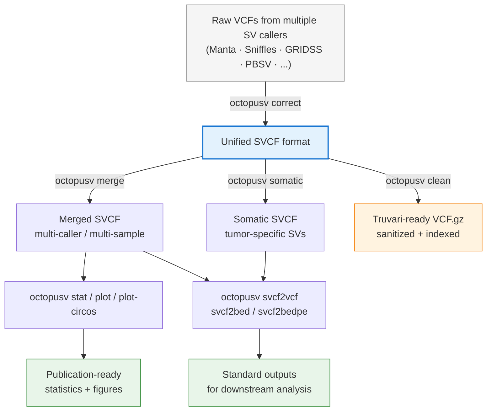

# OctopuSV: End-to-end structural variant post-processing 🐙

<p align="center">
  
</p>

[](https://badge.fury.io/py/octopusv)
[](https://bioconda.github.io/recipes/octopusv/README.html)
[](https://opensource.org/licenses/MIT)

> *Unify, merge, compare, and export structural variants across callers and samples.*

> [!NOTE]
> **What's New in v0.3.4** — New `octopusv plot-circos` subcommand: draws a genome-wide SV Circos overview from an SVCF, with an inner link layer (DEL/DUP/INV/TRA, colored by type) and an outer breakpoint-density histogram. Also fixes multi-sample loss in `octopusv svcf2vcf` (all sample columns are now preserved on SVCF→VCF conversion) and resolves a flag conflict in `octopusv stat`.
>
> ```bash
> octopusv plot-circos -i input.svcf -o circos.png
> ```
>
> <p align="center">
>   
> </p>

> [!IMPORTANT]
> **Always use the latest version for best results.**
>
> ```bash
> conda install bioconda::octopusv
> ```

<details>
<summary><b>Previous releases</b></summary>

- **v0.3.3** — `octopusv correct` now handles multi-sample VCFs (joint-called outputs from GRIDSS, DELLY, etc.), preserving all sample columns.
- **v0.3.2** — New `octopusv clean` subcommand: sanitizes broken VCFs so strict tools like Truvari and bcftools can parse them (`octopusv clean input.vcf output.vcf.gz -g reference.fa`).
- **v0.3.1** — Native GRIDSS support: `octopusv correct` resolves paired BND records into standard SV types directly, no external pre-processing needed.

</details>

---

**OctopuSV** addresses four key challenges in structural variant (SV) analysis:

1. **Smart BND standardization** — Converts paired BND records into standard SV types (DEL/INV/DUP/INS/TRA), while preserving potential complex rearrangements as BNDs. Works out of the box with BND-heavy callers like GRIDSS and SvABA.
2. **Multi-caller integration** — Merge SVs from different tools (Manta, Sniffles, GRIDSS, PBSV, etc.) with flexible Boolean logic.
3. **Multi-sample integration** — Compare and analyze SVs across cohorts with customizable sample-level merging.
4. **Somatic variant calling** — Extract tumor-specific SVs by comparing tumor vs normal samples. Works with any SV caller, even those not designed for cancer analysis.

Whether you're analyzing single samples, cohorts, or tumor/normal pairs, OctopuSV standardizes your workflow from raw calls to publication-ready results.

---

## How OctopuSV Works

OctopuSV converts any SV caller's VCF into a unified intermediate format (**SVCF**), enabling consistent merging, comparison, and analysis across callers and samples. Results can be exported back to standard VCF, BED, or BEDPE formats.



**Why SVCF?** Different SV callers implement VCF inconsistently — varying field names, BND notations, coordinate systems. SVCF eliminates these compatibility issues by providing a unified intermediate format.

```bash
# Step 1: Standardize caller outputs
octopusv correct manta_output.vcf manta.svcf
octopusv correct gridss_output.vcf gridss.svcf
octopusv correct sniffles_output.vcf sniffles.svcf

# Step 2: Analyze with consistent format
octopusv merge -i manta.svcf gridss.svcf sniffles.svcf -o merged.svcf --intersect
octopusv somatic -t tumor.svcf -n normal.svcf -o somatic.svcf

# Step 3: Convert back to standard VCF
octopusv svcf2vcf -i merged.svcf -o final_results.vcf
```

📋 **SVCF Format Details**: See our [SVCF specification document](https://github.com/ylab-hi/OctopuSV/blob/main/docs/SVCF_specifications.md) for technical details.

---

## Supported SV Callers

**Long-read**: Sniffles, Severus, SVDSS, DeBreak, SVIM, CuteSV, PBSV, nanomonsv

**Short-read**: Manta, Delly, GRIDSS, Lumpy, SvABA, Octopus, CLEVER

**CNV callers**: Dragen CNV (automatic conversion of CNV to DEL/DUP)

Continuously expanding support for additional callers.

---

## Installation

### Bioconda (recommended)

```bash
conda install bioconda::octopusv
```

This installs OctopuSV along with all required dependencies including `bcftools`, `bgzip`, and `tabix`.

Or with mamba for faster dependency resolution:

```bash
mamba install bioconda::octopusv
```

### PyPI

```bash
pip install octopusv
```

> [!NOTE]
> The `octopusv clean` subcommand requires `bcftools`, `bgzip`, and `tabix` as external tools. If you installed via pip, install them separately:
> ```bash
> conda install -c bioconda bcftools htslib
> ```
> If you installed via Bioconda, these are already included.

### Docker

```bash
docker pull quay.io/biocontainers/octopusv:<tag>
```

See [octopusv/tags](https://quay.io/repository/biocontainers/octopusv?tab=tags) for valid values.

### From source (for developers)

```bash
git clone https://github.com/ylab-hi/OctopuSV.git
cd OctopuSV
mamba env create -f environment.yaml
mamba activate octopusv
poetry install
```

---

## Quick Start

### 1. Correct and Standardize BND Annotations

`octopusv correct` converts raw SV caller output into standardized SVCF format. This includes resolving paired BND records into concrete SV types and detecting insertions from BND pairs with long inserted sequences (e.g., from GRIDSS).

```bash
# Basic correction
octopusv correct input.vcf output.svcf

# With position tolerance control (for BND pairing)
octopusv correct -i input.vcf -o output.svcf --pos-tolerance 5

# Apply quality filters
octopusv correct -i input.vcf -o output.svcf --min-svlen 50 --max-svlen 100000 --filter-pass
```

### 2. Merge SV Calls (Multi-caller or Multi-sample)

```bash
# Intersection: SVs found by ALL callers
octopusv merge -i manta.svcf sniffles.svcf pbsv.svcf -o intersection.svcf --intersect

# Union: SVs found by ANY caller
octopusv merge -i caller1.svcf caller2.svcf caller3.svcf -o union.svcf --union

# Specific caller: SVs unique to one caller
octopusv merge -i manta.svcf sniffles.svcf -o manta_specific.svcf --specific manta.svcf

# Minimum support: SVs supported by at least N callers
octopusv merge -i a.svcf b.svcf c.svcf d.svcf -o supported.svcf --min-support 3

# Complex Boolean logic: (A AND B) but NOT (C OR D)
octopusv merge -i A.svcf B.svcf C.svcf D.svcf \
  --expression "(A AND B) AND NOT (C OR D)" -o filtered.svcf

# Multi-sample mode with custom names
octopusv merge -i sample1.svcf sample2.svcf sample3.svcf \
  --mode sample --sample-names Patient1,Patient2,Patient3 \
  --min-support 2 -o cohort.svcf

# Generate intersection plot
octopusv merge -i a.svcf b.svcf c.svcf -o merged.svcf --intersect \
  --upsetr --upsetr-output venn_diagram.png
```

<p align="center">
  
</p>

### 3. Somatic SV Calling

Use any SV caller to analyze tumor and normal samples separately, then let OctopuSV find somatic variants. Works even with callers not designed for cancer analysis.

```bash
# Basic somatic calling
octopusv somatic -t tumor.svcf -n normal.svcf -o somatic.svcf

# With custom matching parameters
octopusv somatic -t tumor.svcf -n normal.svcf -o somatic.svcf \
  --max-distance 100 --min-jaccard 0.8

# Convert to standard VCF for downstream analysis
octopusv svcf2vcf -i somatic.svcf -o somatic.vcf
```

**Example multi-caller somatic workflow** (e.g., with 3 callers on a tumor-normal pair):

```bash
# Run each caller separately on the tumor-normal pair, then standardize
octopusv correct manta_tumor.vcf manta_tumor.svcf
octopusv correct delly_tumor.vcf delly_tumor.svcf
octopusv correct gridss_tumor.vcf gridss_tumor.svcf

# Keep SVs supported by at least 2 out of 3 callers
octopusv merge -i manta_tumor.svcf delly_tumor.svcf gridss_tumor.svcf \
  -o high_confidence_somatic.svcf --min-support 2
```

### 4. Clean Broken VCFs for Downstream Tools

Some callers produce VCFs that are technically valid but break strict parsers like Truvari or bcftools — missing header definitions, illegal characters in INFO fields, inconsistent chromosome naming, missing `GT` or `SVLEN`. `octopusv clean` fixes these issues without filtering any variants, producing a sorted, bgzipped, tabix-indexed VCF ready for downstream benchmarking.

```bash
# Basic clean (no chromosome harmonization)
octopusv clean broken.vcf fixed.vcf.gz

# With reference FASTA for chromosome name harmonization (recommended)
octopusv clean broken.vcf fixed.vcf.gz -g /path/to/reference.fa

# Typical workflow: clean before Truvari benchmark
octopusv clean calls.vcf calls_clean.vcf.gz -g GRCh38.fa
truvari bench -b truth.vcf.gz -c calls_clean.vcf.gz -f GRCh38.fa -o bench_results/
```

What `clean` fixes:
- Removes `RNAMES` field and sanitizes illegal characters in INFO
- Fills missing `SVLEN` based on `SVTYPE` and `END`
- Ensures `GT` is the first FORMAT field with a valid value
- Auto-generates missing INFO/FORMAT header definitions
- Harmonizes chromosome names against a reference FASTA when `-g` is provided
- Sorts, bgzips, and tabix-indexes the output

### 5. Benchmark Against Truth Sets

```bash
octopusv benchmark truth.vcf calls.svcf \
  -o benchmark_results \
  --reference-distance 500 \
  --size-similarity 0.7 \
  --reciprocal-overlap 0.0 \
  --size-min 50 --size-max 50000
```

### 6. Generate Statistics and Visualizations

```bash
# Basic stat collection
octopusv stat -i input.svcf -o stats.txt

# Add HTML report
octopusv stat -i input.svcf -o stats.txt --report

# Plot figures from stats
octopusv plot stats.txt -o figure_prefix
```

The `--report` flag outputs an interactive HTML report covering SV type and size distributions, chromosome breakdowns, quality score summaries, and genotype and depth features.

<p align="center">
  
</p>

`octopusv plot-circos` draws a whole-genome SV landscape directly from an SVCF: an inner link layer (DEL/DUP/INV/TRA, colored by type) and an outer breakpoint-density histogram. Useful for spotting chromosome-level breakpoint clustering and complex-rearrangement regions at a glance.

```bash
# Basic Circos overview
octopusv plot-circos -i input.svcf -o circos.png

# Plot only translocations (interchromosomal links)
octopusv plot-circos -i input.svcf -o circos_tra.png --tra-only

# Use a custom reference .fai for chromosome sizes (default: built-in hg38)
octopusv plot-circos -i input.svcf -o circos.png --fai reference.fa.fai
```

INS is excluded from links by default. Events larger than `--intra-max-span` are written to an oversized-intra table next to the figure for manual inspection. See `octopusv plot-circos -h` for all options (support thresholds, span filters, per-type toggles, arc styling).

### 7. Format Conversion

```bash
# To BED
octopusv svcf2bed -i input.svcf -o output.bed

# To BEDPE
octopusv svcf2bedpe -i input.svcf -o output.bedpe

# To standard VCF
octopusv svcf2vcf -i input.svcf -o output.vcf
```

---

## Example Visualizations

OctopuSV generates publication-ready visualizations:

<p align="center">
  
</p>

<p align="center">
  
</p>

<p align="center">
  
</p>

---

## Citation

If you use OctopuSV in your research, please cite:

> Guo, Qingxiang, Yangyang Li, Ting-You Wang, Abhi Ramakrishnan, and Rendong Yang. "OctopuSV and TentacleSV: a one-stop toolkit for multi-sample, cross-platform structural variant comparison and analysis." Bioinformatics (2025): btaf599. doi: https://doi.org/10.1093/bioinformatics/btaf599

```bibtex
@article{guo2025octopusv,
  title={OctopuSV and TentacleSV: a one-stop toolkit for multi-sample, cross-platform structural variant comparison and analysis},
  author={Guo, Qingxiang and Li, Yangyang and Wang, Ting-You and Ramakrishnan, Abhi and Yang, Rendong},
  journal={Bioinformatics},
  pages={btaf599},
  year={2025},
  publisher={Oxford University Press}
}
```

If you find OctopuSV useful, a ⭐ on GitHub helps others discover the project!

See the companion pipeline: [TentacleSV](https://github.com/ylab-hi/TentacleSV)

---

## Contributing

We welcome issues, suggestions, and pull requests!

```bash
git clone https://github.com/ylab-hi/OctopuSV.git
cd OctopuSV
mamba env create -f environment.yaml
mamba activate octopusv
poetry install
pre-commit run -a
```

## Contact

- GitHub Issues: [https://github.com/ylab-hi/octopusV/issues](https://github.com/ylab-hi/octopusV/issues)
- Email: [qingxiang.guo@northwestern.edu](mailto:qingxiang.guo@northwestern.edu)
- Email: [yangyang.li@northwestern.edu](mailto:yangyang.li@northwestern.edu)